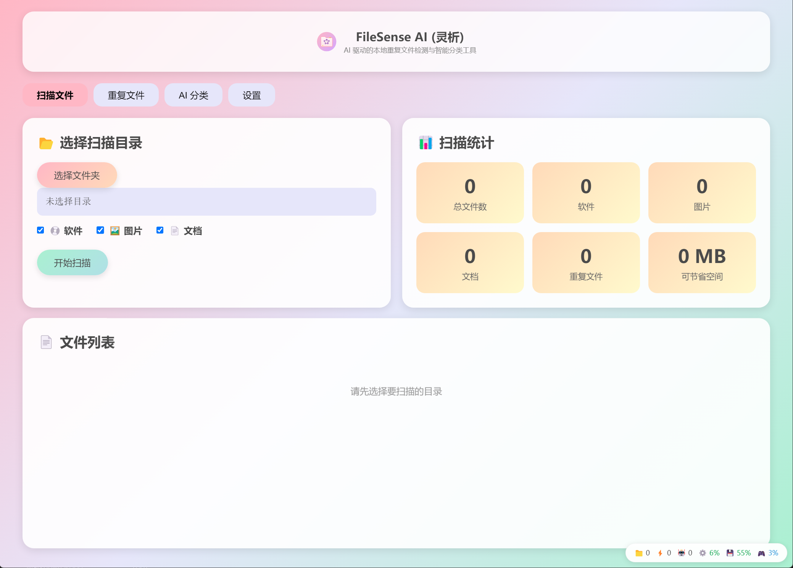
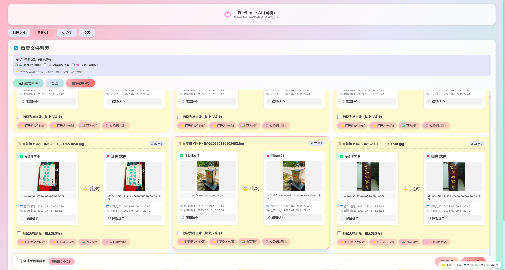

# FileSense AI (灵析)

<p align="center">
  
</p>

<p align="center">
  <strong>AI 驱动的本地文件智能整理助手</strong>
</p>

<p align="center">
  <a href="#-功能特性">功能特性</a> •
  <a href="#-快速开始">快速开始</a> •
  <a href="#-截图展示">截图展示</a> •
  <a href="#-技术架构">技术架构</a> •
  <a href="#-赞助支持">赞助支持</a>
</p>

<p align="center">
  
  
  
</p>

---

## 项目简介

**FileSense AI (灵析)** 是一款专为重度电脑用户、创作者和极客打造的下一代桌面文件整理助手。

基于 Electron 架构，内嵌了极其轻量且强悍的**本地 AI 引擎**（涵盖 BGE 语义向量、CLIP 视觉理解与 Qwen 语言模型），将传统的文件管理从死板的"哈希精确匹配"，拉升到了"**AI 语义模糊理解**"的全新维度。

**100% 本地运行，无需联网，保护隐私**

---

## 功能特性

### 三层 AI 架构

| 层级 | 模型 | 功能 | 内存占用 |
|------|------|------|----------|
| **Embedding** | BGE-Micro-V2 (22MB) | 文档语义去重 | ~50MB |
| **CLIP** | CLIP-ViT-B32 (150MB) | 图片跨模态理解 | ~200MB |
| **LLM** | Qwen2.5-1.5B (1.5GB) | 智能差异分析 | ~2GB |

### 核心功能

- **智能重复检测**
  - 传统 MD5 哈希精确匹配
  - AI 语义相似度分析（文档）
  - 感知哈希相似度分析（图片）
  - 深度内容比对

- **AI 智能分类**
  - 基于文件内容的智能分类
  - 支持图片、文档、视频、音频等类型
  - 自定义分类规则

- **高效处理**
  - 多线程并行处理
  - 虚拟滚动优化（支持百万级文件）
  - 增量扫描，断点续传

---

## 快速开始

### 下载安装

1. 前往 [Releases](https://github.com/yourusername/filesense-ai/releases) 页面
2. 下载对应系统的安装包
3. 安装并运行

### 源码运行

```bash
# 克隆仓库
git clone https://github.com/yourusername/filesense-ai.git
cd filesense-ai

# 安装依赖
npm install

# 运行开发版本
npm run dev

# 构建发布版本
npm run build
```

---

## 截图展示

### 主界面 - 文件扫描
<p align="center">
  
</p>

### 重复文件检测
<p align="center">
  
</p>

### AI 引擎配置
<p align="center">
  
</p>

### 智能分类
<p align="center">
  
</p>

### 图片预览与管理
<p align="center">
  
</p>

---

## 技术架构

```
┌─────────────────────────────────────────────────────────────┐
│                      FileSense AI                           │
│                    (Electron + Node.js)                     │
├─────────────────────────────────────────────────────────────┤
│  ┌─────────────┐ ┌─────────────┐ ┌─────────────────────┐   │
│  │   扫描模块   │ │  重复检测    │ │     AI 智能分类      │   │
│  │  • 多线程   │ │  • MD5 哈希  │ │  • 语义理解         │   │
│  │  • 增量扫描 │ │  • AI 相似度 │ │  • 自动归类         │   │
│  │  • 虚拟滚动 │ │  • 感知哈希  │ │  • 智能推荐         │   │
│  └─────────────┘ └─────────────┘ └─────────────────────┘   │
├─────────────────────────────────────────────────────────────┤
│                      AI 引擎管理层                           │
├─────────────────────────────────────────────────────────────┤
│  ┌─────────────┐ ┌─────────────┐ ┌─────────────────────┐   │
│  │ BGE-Micro   │ │ CLIP-ViT    │ │    Qwen2.5-1.5B     │   │
│  │  22MB       │ │   150MB     │ │      1.5GB          │   │
│  │ 文档语义向量│ │ 图片视觉理解│ │   智能分析推理      │   │
│  └─────────────┘ └─────────────┘ └─────────────────────┘   │
└─────────────────────────────────────────────────────────────┘
```

### 技术栈

- **前端**: HTML5 + CSS3 + Vanilla JavaScript
- **桌面框架**: Electron
- **AI 引擎**: node-llama-cpp
- **数据库**: SQLite (better-sqlite3)
- **构建工具**: electron-builder

---

## 系统要求

| 配置项 | 最低要求 | 推荐配置 |
|--------|----------|----------|
| **操作系统** | Windows 10 / macOS 10.15 / Linux | Windows 11 / macOS 13 |
| **CPU** | x64 双核 | x64 四核以上 |
| **内存** | 4GB | 8GB 以上 |
| **存储** | 500MB 可用空间 | 2GB 可用空间 |
| **显卡** | 集成显卡 | 支持 CUDA 的独立显卡 |

---

## 打包发布

### 环境准备

| 系统 | 必要依赖 |
|------|----------|
| **Windows** | Node.js 18+, Python 3.x, Visual Studio 2022 (或 Build Tools) |
| **macOS** | Node.js 18+, Xcode Command Line Tools |
| **Linux** | Node.js 18+, build-essential (gcc/g++) |

### 安装依赖

```bash
# 克隆仓库
git clone https://github.com/yourusername/filesense-ai.git
cd filesense-ai

# 安装项目依赖
npm install
```

### 打包命令

```bash
# Windows 打包
npm run build:win
# 或运行脚本: .\scripts\build-windows.bat

# macOS 打包
npm run build:mac
# 或运行脚本: bash scripts/build-macos.sh

# Linux 打包
npm run build:linux
# 或运行脚本: bash scripts/build-linux.sh

# 全平台打包（需在对应系统上分别执行）
npm run build:all
```

### 输出文件

打包完成后，文件生成在 `dist/` 目录：

| 系统 | 安装包 | 绿色版 |
|------|--------|--------|
| **Windows** | `FileSense-AI-x.x.x-Windows-Setup-x64.exe` | `FileSense-AI-x.x.x-Windows-Portable-x64.exe` |
| **macOS** | `FileSense-AI-x.x.x-macOS-Installer-x64.dmg` | `FileSense-AI-x.x.x-macOS-x64.zip` |
| **Linux** | `FileSense-AI-x.x.x-Linux-deb-x64.deb` | `FileSense-AI-x.x.x-Linux-AppImage-x64.AppImage` |

### 使用 GitHub Actions 自动打包

项目已配置 GitHub Actions，推送标签时自动打包所有平台版本。

**手动触发打包：**
1. 进入 GitHub 仓库的 Actions 页面
2. 选择 "Build and Release" 工作流
3. 点击 "Run workflow"，输入版本号（如 v1.0.0）

**自动触发打包：**
```bash
# 创建并推送标签
git tag v1.0.0
git push origin v1.0.0
```

打包完成后，Release 页面会自动发布所有安装包。

### 常见问题

**1. sqlite3 编译失败**
```bash
# Windows: 安装 Visual Studio Build Tools
choco install visualstudio2022buildtools

# 或使用预编译版本
npm install sqlite3 --build-from-source=false
```

**2. Electron 下载慢**
```bash
# 配置国内镜像
npm config set electron_mirror https://npmmirror.com/mirrors/electron/
```

详细打包指南请查看 [PACKAGING.md](PACKAGING.md)

---

## 开源协议

本项目基于 [MIT](LICENSE) 协议开源。

---

## 致谢

- [node-llama-cpp](https://github.com/withcatai/node-llama-cpp) - 本地 AI 引擎
- [BAAI/bge](https://huggingface.co/BAAI) - 语义向量模型
- [Qwen](https://huggingface.co/Qwen) - 语言模型
- [Electron](https://www.electronjs.org/) - 桌面应用框架

---

<p align="center">
  Made with by FileSense AI Team
</p>
